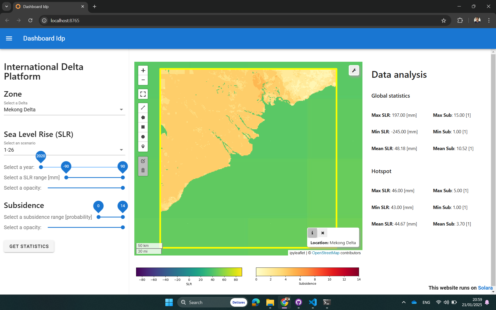
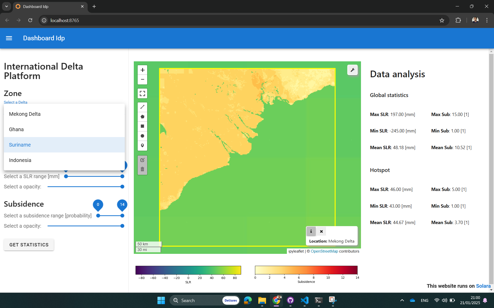
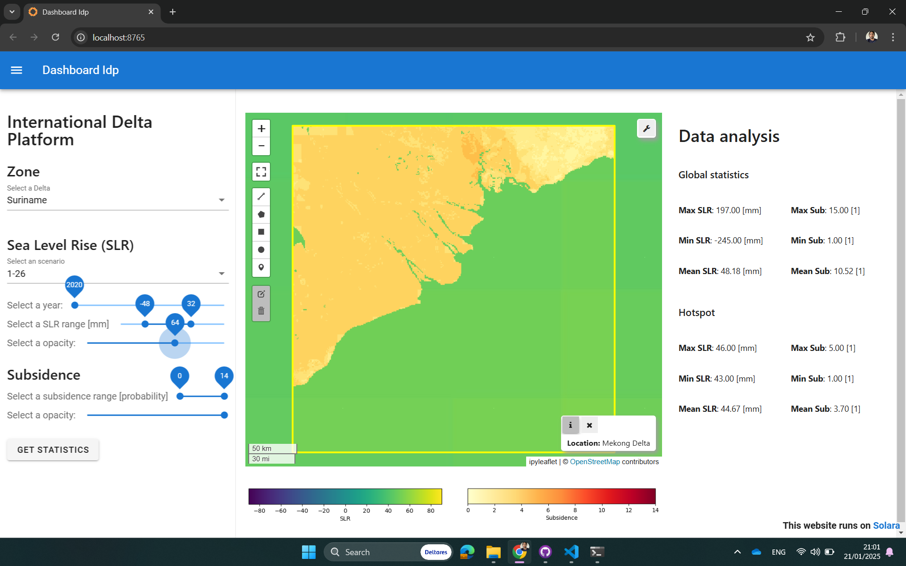
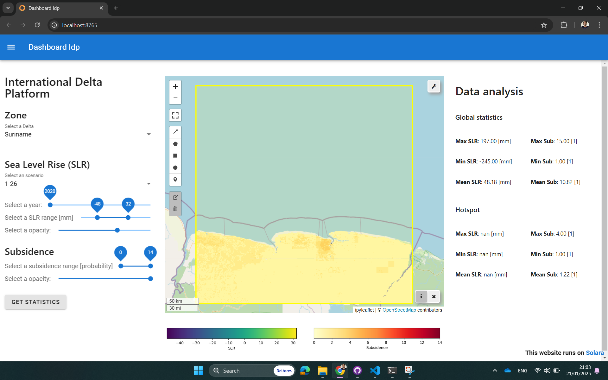

# International Delta Platform Documentation

## User Guide

## Description of Tools 
### Dashboard
#### Installation
The repository contains the necessary environments and tools to visualize the first version of the IDP dashboard. Follow these steps to install the required packages and run the server (Solara server) to visualize the dashboard.

Install the environment using the following command in the Miniforge prompt (more information about Miniforge installation [here](https://github.com/conda-forge/miniforge)):
```
conda env create -f environments/environment.yml
```

After installing the Python packages, activate the environment and run the application by executing the following commands in the Miniforge prompt:
```
conda activate idp-dashboard
```
```
solara run dashboard/dashboard-idp.py
```

**Note:** The *.yml and .py files are relative to the repository path on your computer. Ensure you change your directory to the repository location folder before running the commands. 

#### Roadmap 

After running the application, the following page will open in your browser: [http://localhost:8765/](http://localhost:8765/).



The application allows you to select different settings from the sidebar on the left, such as Zone (currently, only four deltas are available) and the visualization settings for the Sea Level Rise (SLR) and Subsidence layers.



The visualization settings for the SLR layer allow you to select data for a specific year and scenario and visualize data for a specific range. The opacity of the layer can also be adjusted to better visualize the basemap and the subsidence layer.

The Subsidence layer is not provided per year or scenario but for a single time and scenario of analysis. However, it works similarly to the SLR layer regarding range and opacity. The layer selection is based on the selected zone.



After selecting the desired settings, press the "Get statistics" button to calculate the mean, minimum, and maximum values of SLR and Subsidence in the global dataset, as well as for the selected Zone and Range (also called hotspot).



#### Useful Links (I will continue the documentation in the next session)
- [Solara Dashboard Tutorial Part 1](https://solara.dev/documentation/getting_started/tutorials/jupyter-dashboard-part1)
- [Solara Examples: ipyleaflet](https://solara.dev/documentation/examples/libraries/ipyleaflet)
- [IDP Workbench Repository](https://github.com/Deltares-research/IDP-workbench)
- [Deltares Issue Tracker - DSC-159](https://issuetracker.deltares.nl/browse/DSC-159)

## Contact
For further enquiries regarding the use of the applications described in this repository, please approach the following developers: Mario Fuentes Monjaraz (Mario.FuentesMonjaraz@deltares.nl) and Etiënne Kras (etienne.kras@deltares.nl). 
